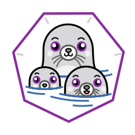

<br>
<p align="center">

<br><br>

# Podman - Быстый старт
Присоединяйтесь к нам - [Youtube](https://www.youtube.com/channel/UCqC3c7UHtwoX2wy7fdHc6gg) и [Telegram](https://t.me/devops_mops)

## Содержание
- [Что такое Podman?](#Что-такое-Podman?)
- [Установка Podman](#Установка-Podman)
- [Базовые команды](#Базовые-команды)

<br>

## Что такое Podman?
Podman: A tool for managing OCI containers and pods

Podman - Pod manager tools

Можно считать его Daemonless Docker и даже сделать алиас
```
alias docker=podman
```

OCI Containers

<br>

## Установка Podman
Так же как Docker поддерживает установку для разных ОС - 
https://podman.io/getting-started/installation

<br>

## Базовые команды

podman version

podman pull

podman ls